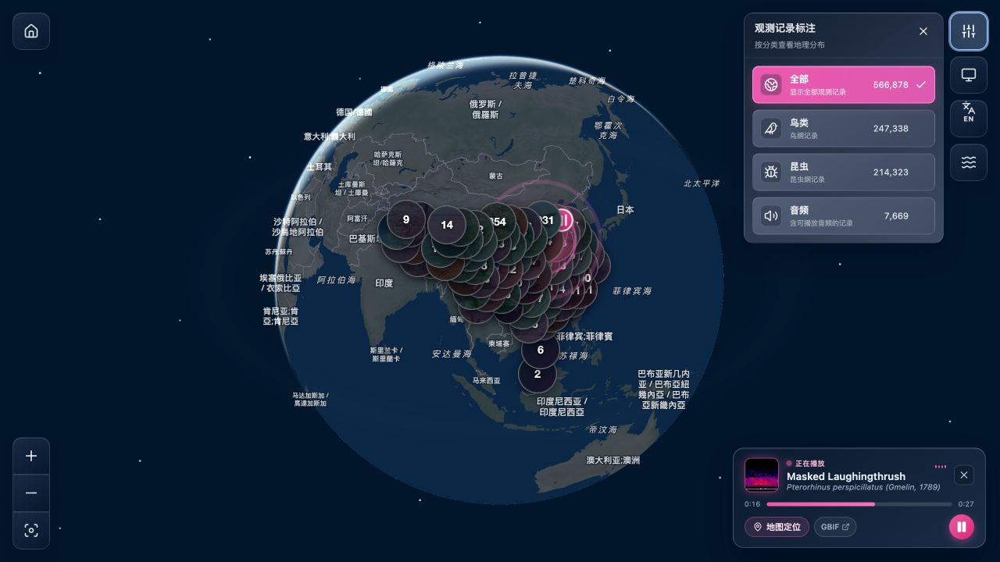
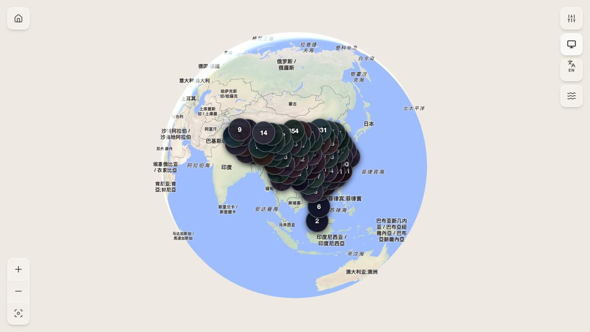

# 真实 GBIF 五十万级数据验收报告

验收日期：2026-10-06（Asia/Shanghai）。技术规范：[TanStack Start / PostgreSQL 开发文档](./TANSTACK_START_POSTGRESQL_DEVELOPMENT.md)。

## 1. 结论

**已完成用户提供 ZIP 的真实导入、聚合、地图构建、发布、数量对账、热点完整分页、20/50 并发 API 测试和浏览器检查。实际活动数据集包含 572,391 条动物观测。整体验收未通过。**

观测 ID 和主要分类/媒体计数对账通过。物种键兼容、部分音频源配置、空坐标语义、密集标记显示、独立详情页布局及 50 并发音频网格延迟存在问题，见第 6 节。当前结果不能宣称全部功能满足规范，也不能代替一百万条及生产环境验收。

预览：<http://127.0.0.1:4319/>。活动发布 ID：`4`；数据版本：`gbif-0038781-20261006`；revision：`1e6c848e-3677-4a48-845c-90fd4ff82cf9`。历史样例保留为发布 `3`，回滚演练后已恢复发布 `4`。

## 2. 数据包及导入范围

- 原文件：`/Users/zhengyuan/Downloads/0038781-260806074905277.zip`。
- ZIP：488,539,479 字节；全部文件解压总大小：2,349,827,362 字节。
- 389 个文件 CRC 完整性检查全部通过。
- SHA-256：`b03957f5a57299f804d81ae8b480979343d1ff69920625b0d0a57684b5fb668d`。
- 依据 `meta.xml` 读取主 `occurrence.txt` 和规范化的 `multimedia.txt`；verbatim 扩展保留在原 ZIP 中，不重复作为规范化媒体入库。
- 项目配置 `IMPORT_KINGDOM=Animalia`：源包 914,853 条观测中选中 572,391 条。其余 342,462 条属于植物、真菌及其他分类，按当前导入规则排除。
- PG 保存结构化记录、媒体 URL 与元数据；原始远程图片和声音没有全部下载到 PG。

源文件由独立 Python `zipfile` / `csv` / XML 解析器统计，未调用项目导入解析器。[源统计](./acceptance/2026-10-06/source.json)、[独立统计脚本](./acceptance/2026-10-06/source-audit.py)、[ZIP 校验](./acceptance/2026-10-06/zip-integrity.json)。

## 3. 数据对账

| 项目 | 源文件应有 | PG / 接口实际 | 结果 |
| --- | ---: | ---: | --- |
| 选中动物观测 | 572,391 | 572,391 | 通过 |
| 可定位记录 | 566,878 | 566,878 | 通过 |
| 鸟类可定位记录 | 247,338 | 247,338 | 通过 |
| 昆虫可定位记录 | 214,323 | 214,323 | 通过 |
| 含音频的可定位记录 | 7,669 | 7,669 | 通过计数检查 |
| 关联媒体资产 | 753,834 | 753,834 | 通过 |
| 非空的不同物种键 | 17,949 | 87 | **未通过** |

完整观测 ID 列表按数值排序后逐行计算 SHA-256，源文件与 PG 都为：

`aaf5d37f32e04e84f251be07cf3632ba7de3210fb59b7d719585212cd7c614cb`

这说明选中观测没有重复或缺失；物种字段关联缺失仍需单独修复。

- 7,742 条观测含声音，共 8,067 个音频资产；其中 7,669 条观测可定位。
- 745,692 个图片资产，涉及 438,438 条观测。
- 无坐标/无效坐标记录 5,513 条；本包无超过 Web Mercator 纬度范围的可定位记录。
- H3 r2–r7 每层的观测计数均为 566,878；r8 的物种与未分类计数相加也是 566,878；精确坐标层计数同样一致。
- 导出 489,494 个地图特征，GeoJSON Sequence 大小 317,842,222 字节。

[数据库对账及执行计划](./acceptance/2026-10-06/database.json)、[地图导出对账](./acceptance/2026-10-06/export.json)。

## 4. 耗时、内存及瓦片

环境：Apple M1 Pro，10 个逻辑 CPU，32 GiB 内存；Node.js 22.23.2；本地 PG/PostGIS；Docker 分配 10 CPU / 约 7.65 GiB。API 使用生产构建，浏览器使用 4319 开发预览。

| 阶段或指标 | 实测 |
| --- | --- |
| 入库和聚合（dataset 创建到 ready） | 242.551 秒，约 4 分 3 秒 |
| Tippecanoe 2.79.0 构建 z0–z18 | 711.60 秒，约 11 分 52 秒 |
| PMTiles 转换 | 62.48 秒 |
| 导入 Worker 已采样 RSS 峰值 | 约 170.27 MiB |
| Tippecanoe 已观察 VmHWM | 483,028 KiB，约 471.71 MiB |
| PMTiles 文件 | 254,634,690 字节，约 242.84 MiB |
| 瓦片数量 | 558,905 |
| 压缩瓦片大小 p95 / p99 | 660 / 1,332 字节 |
| 最大压缩瓦片 | 56,235 字节，约 54.92 KiB |
| 超过 1 MiB 的瓦片 | 0 |

原一键命令的镜像重建触发基础镜像联网下载；本次中止该重复重建后，使用已有相同工具版本镜像完成相同构建参数和发布验证。因此本轮证明分步完整链路可运行，不能把它记作一次不间断的一键命令通过。

内存采样从导入中段开始，不覆盖进程启动前后全部时间；上述 RSS 与 VmHWM 是观察值。PG 表及索引总占用约 1.79 GiB，包含历史小样例和导入产生的版本，不能等同于纯净数据库的每行成本。

逐项扫描全部 PMTiles 目录获得压缩大小分布；各 zoom 抽取最大压缩瓦片解码，19 个样本的 revision/schema 全部一致。导出各层对账通过，但没有逐个解码所有瓦片并比对每个原始点。未测完整 feature 数分布。

真实文件 HEAD 200，头部/后缀 Range 206，越界 Range 416；文件头为 PMTiles，CORS 和不可变缓存头正确。发布使用原验证流程比对本地及 HTTP 文件 SHA-256；回滚到发布 3 后样例详情及瓦片仍可读取，随后恢复真实发布 4。

[瓦片容量报告](./acceptance/2026-10-06/map.json)、[HTTP 验证](./acceptance/2026-10-06/map-http.json)、[构建耗时](./acceptance/2026-10-06/build-timing.json)、[导入内存采样](./acceptance/2026-10-06/import-resources.jsonl)、[回滚结果](./acceptance/2026-10-06/rollback.json)。

## 5. 分页与 API 性能

热点 H3 r2 网格 `824ba7fffffffff` 含 184,790 条记录。按每页 100 条完整读取 1,848 页，核对 184,790 个不同 ID，重复 0、排序错误 0、revision 混杂 0，页总数和聚合总数一致。

- 热点鸟类 / 昆虫 / 音频过滤总数及返回条目分类一致。
- 同坐标热点 `(22.675, 121.469)` 共 19,102 条记录，列表总数正确。
- 101 条页面请求、跨过滤条件复用游标、大数据 overview 请求均被 400 拒绝。
- 元数据及详情固定到当前已发布快照。

生产服务在 `127.0.0.1:4318`，使用本机热缓存、循环发送的混合负载。20 并发 800 请求，50 并发 1,600 请求；再做 50 并发 6,400 请求复测。合计 8,800 个压测请求，HTTP/请求错误 0。持续复测约 31.86 秒，测得约 200.91 请求/秒；这是该本机负载的结果。

下表单位为 ms，均为 p95：

| 接口 | 20 并发 | 50 并发 | 50 并发延长复测 | 文档目标 | 本次判断 |
| --- | ---: | ---: | ---: | ---: | --- |
| 元数据 | 92.25 | 276.98 | 243.17 | ≤300 | 通过本次抽测 |
| 观测详情 | 86.90 | 284.44 | 246.95 | ≤300 | 通过本次抽测 |
| 热点网格列表 | 105.75 | 291.97 | 257.51 | ≤500 | 通过本次抽测 |
| 热点音频列表 | 400.03 | 570.58 | 523.21 | ≤500 | 未通过 |
| 深游标（第 1001 页） | 103.38 | 295.52 | —（复测用第 2 页） | ≤500 | 通过本次抽测 |
| 同坐标列表 | 186.45 | 362.88 | 313.95 | ≤500 | 通过本次抽测 |
| 网格物种列表 | 138.42 | 302.77 | 261.89 | ≤500 | 通过本次抽测 |
| 地图代表记录 | 114.13 | 291.83 | 248.68 | ≤500 | 通过本次抽测 |

50 并发音频网格 p95 523.21ms，仍超过 500ms，未通过该性能预算。物种关联大量缺失也使物种查询负载小于完整数据的真实负载；修复后须重新评估相关性能。

本次为短时闭环压测，没有模拟网络限速，也没有执行持续数小时或固定到达率的生产容量测试。PG 执行计划显示详情和坐标查询走索引；热点音频查询仍需优化，实际 SQL 时间以连接池、序列化和混合并发后的 HTTP 指标为最终判断依据。

[分页及首轮压测](./acceptance/2026-10-06/api.json)、[50 并发延长复测](./acceptance/2026-10-06/api-repeat.json)。

## 6. 未通过项与原因

### 6.1 物种键不兼容

源包包含 `6MJMD` 等字符串物种键。`apps/worker/src/import/dwca-records.ts:115` 将非纯数字键改成 null，DB 的 species / occurrence 字段及 API 契约也使用 BIGINT / 数字 ID。

543,262 条观测带非数字物种键，关联被丢弃。另有 27,782 条本来没有物种键，最终 571,044 条在 PG 中 species_key 为 null。源包 17,949 个非空不同物种键只识别出 87 个。

需统一源物种标识与数据库/接口/游标/聚合的表示，保留原始键，再重新导入及构建。仅修改 UI 无法恢复这次已经丢弃的键。

### 6.2 iNaturalist 声音被代理拒绝

| 源域名 | 音频资产 | 当前允许 | 当前拒绝 |
| --- | ---: | ---: | ---: |
| observation.org | 5 | 5 | 0 |
| xeno-canto.org | 3,994 | 3,994 | 0 |
| static.inaturalist.org | 4,068 | 0 | 4,068 |

`packages/media/src/audioProxy.ts` 的默认允许域名没有 iNaturalist。抽测两条 iNaturalist URL：源站 206、audio/mp4、4,096 字节；当前本地代理返回 400，错误为源域名不在允许列表。受影响观测 3,745 条。

环境声接口返回的当前 100 个候选全来自这个被拒绝的域名。UI 已复现播放失败提示，因此“声景接口返回 100 条”仅说明元数据可读，不能记作声景实际播放通过。选择列表也包含蛙、虫及哺乳类，当前“鸟鸣”文案与实际来源范围不一致。

原截图观测 `5995373399` 在真实 ZIP 中引用 xeno-canto 音频，Range 206、完整代理下载 200（446,633 字节），浏览器重试后缓存及播放成功，27 秒录音进度实际推进到 16 秒，地图光波及浮动播放器同步。第一次下载失败、重试成功；源站访问稳定性仍需观察。

需补齐经过核实的源域名配置，并保证候选音频和“可播放”文案符合实际支持范围。允许 URL 不等于源站永远可用。

[全量域名审计](./acceptance/2026-10-06/audio-hosts.json)、[源站与代理抽测](./acceptance/2026-10-06/audio-probes.json)、[声景候选域名](./acceptance/2026-10-06/ambient-hosts.json)、[xeno-canto 完整下载](./acceptance/2026-10-06/xeno-full.json)。

### 6.3 空坐标被转成 0

观测 `5150131301` 在 PG 的经纬度都为 null，详情 API 却返回 `0,0`。`OccurrenceRepository.mapRowToRecord` 的 Number(null) 转换与卡片默认值会造成误导。应保留 null，显示无法定位，并关闭定位操作。

### 6.4 首屏密集标记可读性失败

桌面 1280×720 首屏观察到 89 个 DOM 标记，数量低于 160 上限，却集中叠在中国区域；多数照片、数字和点位被遮挡。需要依据缩放、实际屏幕距离及遮挡控制聚合/避让，单纯限制 DOM 总数不足。

深浅主题切换可用，图片标记和数据计数可读取；实际密集分布下的页面显示仍不达标。

### 6.5 独立详情页布局失败

实际访问 `/occurrence/5995373399`，观测卡片固定在左上角，返回链接在页面中部被多行折叠。复用悬浮卡片时沿用了绝对/固定定位样式，独立页面需明确布局和样式适配。

### 6.6 50 并发音频列表超预算

首轮 p95 570.58ms，延长复测 523.21ms，均超过 500ms。需要优化热点音频筛选的索引/查询以及连接池等待，然后用相同数据复测。

## 7. 界面证据

### 真实数据、计数、播放进度及光波



### 浅色主题及密集标记重叠



### 声景播放失败


### 详情独立页布局


## 8. 后续验收边界

- 未导入全部分类，也未测试恰好 1,000,000 条有效观测。
- 未测试全球分散、其他热点分布、真实手机、受限网络、桌面/手机 FPS、3 秒首屏目标、20 分钟浏览器内存及 GPU 内存。
- 未验证生产 CDN、备份恢复、长期并发及完整详情 SSR 数据预取 / hydration、URL 状态同步。
- 物种键修复后需要重新导入、重新构建并重新测量，当前物种查询及瓦片结果不能直接套用到修复后的数据。

## 9. 当前保留状态与复现

开发预览保留在 4319；临时生产压测服务完成后关闭。原 ZIP、历史样例与当前真实 PG 快照均保留；生成产物位于 `artifacts/1e6c848e-3677-4a48-845c-90fd4ff82cf9` 和 `data/maps/1e6c848e-3677-4a48-845c-90fd4ff82cf9.pmtiles`。本轮没有修改应用功能代码，新增的是验收资料；未通过项尚未修复。

启动当前预览：

```bash
PUBLIC_APP_URL=http://127.0.0.1:4319 npm run dev -- --host 127.0.0.1 --port 4319
```

导入全新版本时使用唯一版本名，Web 和 Docker 需要运行：

```bash
DATABASE_STATEMENT_TIMEOUT_MS=300000 PUBLIC_APP_URL=http://127.0.0.1:4319 npm run data:setup -- --archive /Users/zhengyuan/Downloads/0038781-260806074905277.zip --version gbif-0038781-retest-20261006
```

这个命令会创建新的完整快照；当前数据已经导入，不需要为了查看效果重复导入。物种兼容问题修复前，重复导入仍会得到相同关联缺失。

快速核验：

```sql
SELECT version, revision, status, occurrence_count, plottable_count,
       species_count, media_count, aves_count, insecta_count, audio_occurrence_count
FROM datasets WHERE version = 'gbif-0038781-20261006';

SELECT mr.id, mr.dataset_revision, mr.pmtiles_url
FROM active_map_release active JOIN map_releases mr ON mr.id = active.release_id;
```
