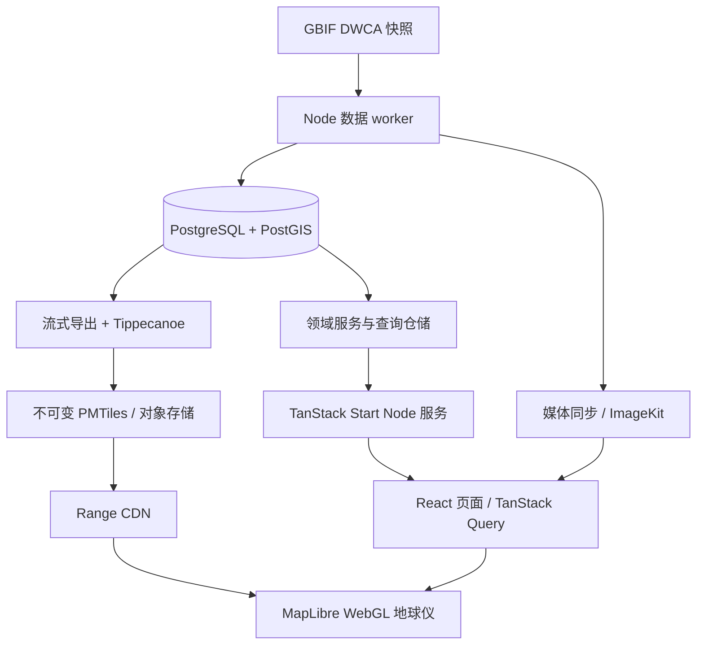

# 十万至百万级 GBIF 地球仪：TanStack Start + PostgreSQL 开发与迁移文档

> 2026-10-06 实现状态：旧 Vue/Fastify 目录已移除，唯一应用为 `apps/web`。已用用户真实 ZIP 导入 572,391 条动物观测并执行对账、发布、热点分页和并发测试；整体验收未通过，详见[真实数据验收报告](./GBIF_REAL_DATA_ACCEPTANCE_20261006.md)。第 2 节保留迁移前的历史基线；百万级、完整详情 SSR 数据预取等仍按本文规范验收。当前操作入口见 [开发手册](./DEVELOPMENT.md)。

> 编写日期：2026-09-28。依据当前工作区实现及 `TECHNICAL_DESIGN.md`、`DEVELOPMENT.md` 编写。
> 状态：待实施的开发方案。本文件不表示框架迁移、数据库迁移或百万级性能验证已经完成。
> 技术选择：TanStack Start（React）+ TypeScript + TanStack Query + PostgreSQL/PostGIS + H3 + PMTiles + MapLibre GL JS。

## 目录

1. [目标与范围](#1-目标与范围)
2. [现有实现与迁移差异](#2-现有实现与迁移差异)
3. [目标架构与技术决策](#3-目标架构与技术决策)
4. [工程结构与运行环境](#4-工程结构与运行环境)
5. [PostgreSQL 数据设计](#5-postgresql-数据设计)
6. [导入、聚合与数据发布](#6-导入聚合与数据发布)
7. [地图渲染与大规模数据策略](#7-地图渲染与大规模数据策略)
8. [服务端接口与查询契约](#8-服务端接口与查询契约)
9. [React、SSR 与客户端状态](#9-reactssr-与客户端状态)
10. [媒体与双语体验](#10-媒体与双语体验)
11. [性能预算与容量规划](#11-性能预算与容量规划)
12. [部署、配置与可观测性](#12-部署配置与可观测性)
13. [开发步骤与迁移里程碑](#13-开发步骤与迁移里程碑)
14. [测试与验收](#14-测试与验收)
15. [风险、边界与后续扩展](#15-风险边界与后续扩展)
16. [资料与实现索引](#16-资料与实现索引)

## 1. 目标与范围

### 1.1 交付目标

将现有 Vue/Vite 前端迁移为 TanStack Start 的 React 全栈应用，将 Fastify HTTP 层逐步替换为 Start Server Routes。保留并模块化现有 PostgreSQL/PostGIS、DWCA 导入、H3 聚合、PMTiles 构建与媒体同步能力。

现有数据库已经是 PostgreSQL；“改为 PG”在本项目中的实际工作是继续使用并完善现有模型、连接管理、索引、发布协议与运维流程，无需另做异构数据库数据搬迁。

规模定义：单个数据快照包含 100,000～1,000,000 条 occurrence。媒体数量、历史版本数量和访问并发单独计算；百万条记录并不意味着百万用户并发。

交付后需要支持：

- 球面地图旋转、缩放、主题切换和中英文切换。
- 全部动物、鸟类、昆虫、有音频记录四种既有筛选。
- 聚合点钻取、同一坐标多记录、游标分页和单条详情。
- 图片画廊、灯箱、视频、录音、环境音及全局悬浮播放器。
- DWCA 流式导入、原始记录保留、许可和数据来源追溯。
- 快照与地图资源一致发布，失败可重试、上线可回滚。
- 页面直达与刷新正常，WebGL 仅在浏览器初始化，SSR 不访问浏览器对象。

### 1.2 数据正确性约束

1. occurrence 的身份是 `(dataset_id, gbif_id)`；物种身份是 `species_key`，科学名只用于展示。
2. 同一物种在多个地点的分布必须保留。
3. 聚合地图特征不等于原始记录；地图合并展示不能删除底层 occurrence。
4. 精确点表示使用数据提供者坐标，不代表已经验证的真实位置精度；同时展示 `coordinateUncertaintyInMeters`。
5. 图上数量、筛选后的列表和统计接口必须使用相同数据 revision 与筛选口径。
6. 客户端不能下载全量记录后再聚合；SSR HTML 中也不能内嵌全量数据。
7. GBIF ID、物种 key、数据库 BIGINT 标识符通过 JSON 和瓦片属性时使用字符串，避免 JavaScript 精度损失。

### 1.3 第一阶段边界

首版保持现有四种筛选和快照式更新。国家、年份区间、任意物种组合筛选以及实时写入地图作为后续能力，有独立的服务端聚合和瓦片设计，不能仅增加一个前端筛选按钮就宣称完成。

## 2. 现有实现与迁移差异

### 2.1 已核对的实现

以下路径相对于仓库根目录；本次核对包含工作区尚未提交的全局音频播放器实现。迁移启动时应保存对应提交和截图作为基线。

| 模块 | 当前实现依据 | 迁移处理 |
|---|---|---|
| 前端 | `frontend/package.json`：Vue `^3.5.41`、Vite `^8.2.2` | React + Start，精确依赖由迁移分支 lockfile 固定 |
| 页面编排 | `frontend/src/App.vue` | 拆为路由页面、查询 hooks、地图交互控制器 |
| 地图引擎 | `MapProvider.vue`：有 token 选 Mapbox，否则选 MapLibre | 生产主路径统一 MapLibre；Mapbox 如保留，单独做适配验收 |
| 大数据图层 | `ScalableOccurrenceLayer.vue` | 保留 vector source/circle/symbol 方案，改为 React 生命周期 |
| 演示数据 | `App.vue` 静态导入样例并使用浏览器聚合 | `sample` 独立按需加载，生产 `api` 路径不导入样例 |
| API | `backend/src/app.ts`、`routes/*`：Fastify | 先保持兼容，最终由 Start Server Routes 承接 |
| 查询服务 | `backend/src/services/occurrence.service.ts` | 抽取可复用服务，保留参数化 SQL 与批量媒体查询 |
| 数据库 | `backend/compose.yml`：PG 16 + PostGIS 3.5 | 沿用起始基线，生产镜像锁 digest/补丁版本 |
| 迁移 | `backend/migrations/001`～`006`、`db/migrate.ts` | 保留既有迁移历史，仅增加后续版本 |
| 导入 | `backend/src/import/*` | 独立 Node worker/CLI，避免放入 HTTP 请求 |
| 瓦片 | `backend/src/map/*` | 保留 NDJSON → Tippecanoe → PMTiles → S3/R2 |
| 媒体同步 | `backend/src/media/sync-imagekit.ts` | 保留数据库持久任务、领取与重试机制 |
| 音频 | `useGlobalAudioPlayer.js`、`audioCache.js` | React Provider + 浏览器音频服务，保留缓存与互斥播放 |
| 部署 | 静态前端/Sites Worker + 独立 API | Start Node 服务 + 数据 worker + PG + CDN |

### 2.2 原技术文档与源码需要区分的细节

**高缩放坐标点。** 原技术文档描述 15～18 级“每条 occurrence 原始坐标”。当前 `export-map-features.ts` 实际按 H3 单元及原始经纬度 `GROUP BY`，导出 `kind='coordinate'`，同坐标多条记录合成一个特征。目标保留这一优化：位置来自原始坐标，点击后分页访问全部成员。

**聚合中心。** 导出函数 `mapCellFeature`、`speciesCellFeature` 用 `cellToLatLng` 得到规范 H3 中心；`rebuild-aggregates.ts` 中表的 `anchor` 当前写入代表记录的几何。静态瓦片位置因此正确，但将来直接用聚合表做动态瓦片前，必须将 `anchor` 更新为规范中心，或使用显式 `display_geom`，避免两个渲染路径位置不同。

**版本校验。** 瓦片与前端已有 version/revision 比对。当前 HTTP 查询主要按 `ACTIVE_DATASET_VERSION` 读取，并未要求每次请求带 revision；比对 meta 后再请求详情之间仍可能发生发布切换。目标增加服务端 revision 固定与校验。

**聚合性能。** occurrence 列表总数优先读预聚合表，但 `listCellSpecies` 当前仍从 occurrence 做分组和 distinct 计数。迁移时不能把所有物种分页都视为已经预聚合。

**SSR。** `App.vue` 初始化直接读取 `localStorage`，音频 composable 有模块级共享状态。迁移到 SSR 后要改成明确的浏览器初始化和请求隔离，不能机械翻译为顶层 React 状态。

**数量语义。** `audio_count` 是音频媒体数，`audio_occurrence_count` 是有音频的记录数。r8 物种特征目前主要带 `audio_count`，目标补充记录数，确保“一条记录三段音频”显示为一条记录。

**运行环境。** 根目录/前端要求 Node ≥22.13，后端限制 Node 20；目标统一受依赖支持的 Node 22 补丁版本，并实际验证 worker、SDK 和构建工具。

## 3. 目标架构与技术决策

### 3.1 逻辑架构



TanStack Start 提供 React 路由、SSR、服务端函数和 HTTP 服务端路由；它负责应用交互与服务边界，地图规模主要由瓦片、聚合和按需查询控制。[官方概览](https://tanstack.com/start/latest/docs/framework/react/overview)

### 3.2 关键决策

| 决策 | 采用方案 | 原因与代价 |
|---|---|---|
| UI | React + TypeScript | 与 Start React 配套；Vue 模板、composable 与组件测试需要迁移 |
| 路由 | TanStack Router 文件路由 | 页面、URL 搜索参数和接口路由集中管理 |
| 服务端状态 | TanStack Query | 详情、列表与取消请求统一管理；显式限制缓存 |
| 数据库访问 | `pg` + 参数化 SQL | 最大程度复用当前 PostGIS/H3 查询；首版不引入 ORM 重写成本 |
| GIS | PostgreSQL + PostGIS，H3 在 Node 计算 | 沿用当前能力，无需额外部署 PG H3 扩展 |
| 大数据地图 | PMTiles + CDN | 快照数据读多写少，地图流量不经过 PG |
| 地图引擎 | MapLibre GL JS | PMTiles 官方集成可用，统一引擎降低迁移组合数 |
| HTTP | Start Server Routes | 保留稳定 URL、状态码、缓存头和 Range 流式响应 |
| 内部 RPC | 少量 Server Functions | 用于 SSR 入口读取 meta 等应用内部调用，共用领域服务 |
| 数据任务 | 独立 worker/CLI | 导入、聚合和瓦片构建有独立资源与生命周期 |
| 部署 | Node 容器 + 外部 PG + 对象存储 | 适配 `pg`、流式处理和现有 Node 库 |

首版不依赖 React Server Components；SSR + Query + Server Routes 已满足需求。Redis、数据库分区、读副本也不是百万条记录的前置条件，按监控证据引入。

### 3.3 请求与职责边界

- 首屏：Start 渲染页面壳、标题、语言和少量 meta；浏览器加载地图代码并请求 PMTiles Range。
- 悬停/点击：地图命中特征 → revision 检查 → Query 查询详情或列表 → PG 读取一页。
- 数据发布：worker 导入 → 聚合 → 瓦片验证 → 发布 manifest → 更新活动发布指针。
- 媒体：优先直接访问 CDN；受限音频通过带白名单和限额的流式代理。

Server Routes 适合公开 HTTP 契约；Server Functions 适合应用内部调用。两者只能封装同一领域服务，不能各写一套 SQL。[官方 Server Routes](https://tanstack.com/start/latest/docs/framework/react/guide/server-routes)

## 4. 工程结构与运行环境

### 4.1 建议目录

```text
apps/
  web/                         # TanStack Start
    src/
      router.tsx               # 每个 SSR 请求独立的 Router/QueryClient
      routes/
        __root.tsx
        index.tsx
        occurrence.$gbifId.tsx
        api.v1.meta.ts
        api.v1.occurrences.$gbifId.ts
        api.v1.cells.$resolution.$cellId.occurrences.ts
        api.v1.cells.$resolution.$cellId.species.ts
        api.v1.coordinates.$latitude.$longitude.occurrences.ts
        api.audio-proxy.ts
      features/
        globe/                 # MapCanvas、图层、命中与地图状态
        occurrences/           # 列表、详情、分页
        media/                 # 灯箱、播放器、缓存
        filters/
      functions/               # 少量 createServerFn 封装
      server/                  # *.server.ts：配置、连接池、HTTP 适配
      queries/                 # queryOptions / infiniteQueryOptions
      i18n/
      styles/
    vite.config.ts
  worker/
    src/                       # 导入、聚合、导出、上传、发布、媒体任务
packages/
  contracts/                   # DTO、Zod schema、公共常量；无 Node 依赖
  db/                          # PG pool factory、仓储、迁移
  domain/                      # occurrence/meta 服务；不依赖 React/Fastify
  geo/                         # H3 层级、坐标规则、瓦片特征契约
  media/                       # URL 校验及框架无关媒体工具
infra/
  compose.yml
  Dockerfile.web
  Dockerfile.worker
docs/
data/sample/                   # 原版记录，只供数据库种子导入
scripts/                       # 配置加载和 ZIP → PG → 地图发布 CLI
```

这是目标结构，当前仓库尚无这些 `apps/`、`packages/` 目录。初期可先新增 `apps/web`，待服务抽取验证后再移动数据管道。每次移动保持 CLI 和测试可运行。

### 4.2 依赖与构建基线

- 统一 npm workspaces 与根 lockfile；迁移期间不要同时维护同一包的多套锁文件。
- 新增 React、React DOM、`@tanstack/react-start`、`@tanstack/react-router`、`@tanstack/react-query`、`@vitejs/plugin-react`。
- 保留 `pg`、`h3-js`、`pmtiles`、`maplibre-gl`、Zod、DWCA/XML/ZIP 解析和 S3/ImageKit SDK。
- 替换 Vue 图标适配包为对应 React 包；先核对图标名与样式，避免迁移时改变视觉。
- Node、Start、Router、Query、React、Vite 与部署适配器必须一次锁定兼容组合；不在文档中假定某个未验证的最新版本可直接与当前 Vite 8 共用。
- CI 验证 dev、生产 build、生产启动、SSR 页面刷新与 API 响应；仅 dev 启动成功不算框架选型验证通过。

Vite + Nitro 的 Node 部署可按官方 hosting 示例配置；Nitro 接口仍需随锁定版本验证。生产启动文件以实际构建输出为准。[官方 Hosting](https://tanstack.com/start/latest/docs/framework/react/guide/hosting)

```ts
// 目标 apps/web/vite.config.ts；需在所锁版本下验证
import { defineConfig } from 'vite'
import { tanstackStart } from '@tanstack/react-start/plugin/vite'
import { nitro } from 'nitro/vite'
import react from '@vitejs/plugin-react'

export default defineConfig({
  plugins: [tanstackStart(), nitro(), react()],
})
```

### 4.3 服务端隔离

数据库、私钥与服务配置位于 `*.server.ts` 或有明确 server-only 保护的模块。`contracts` 不得通过 barrel export 间接导出数据库代码。

Router loader 也会在客户端导航时运行，不能直接连接 PG。loader 调用 Server Function；浏览器交互通过同源 API 查询。地图、IndexedDB、Audio、DOM 和 localStorage 仅在浏览器生命周期中创建。[执行模型](https://tanstack.com/start/latest/docs/framework/react/guide/execution-model)

## 5. PostgreSQL 数据设计

### 5.1 继续保留的核心表

| 表 | 主键或唯一约束 | 用途与约束 |
|---|---|---|
| `datasets` | `id`、唯一 `version`、唯一 `revision` | 导入快照、状态和统计；区分 ready 与地图已发布 |
| `species` | `species_key` | 共享分类信息；旧快照优先使用 occurrence 分类快照 |
| `occurrences` | `(dataset_id, gbif_id)` | 原始坐标、来源、时间、H3 r2～r8、扩展字段 |
| `media` | `id`；唯一 `(dataset_id, occurrence_gbif_id, identifier)` | 多媒体元数据、许可、镜像地址和同步状态 |
| `map_cells` | `(dataset_id, resolution, cell_id)` | 低中缩放计数 |
| `species_cells` | `(dataset_id, resolution, cell_id, species_key)` | r8 物种与网格聚合 |

`geom` 保留 `geometry(Point,4326)` 和 GiST 索引。`dataset_key` 表示 GBIF 来源数据集 UUID，与应用导入快照的 `dataset_id` 不同。

### 5.2 建议新增或调整的字段

分批、向后兼容地新增：

| 对象 | 新字段/调整 | 目的 |
|---|---|---|
| occurrences | `class_name_snapshot TEXT` | 避免每次筛选 JSON 提取并回退 JOIN；由导入时分类生成 |
| occurrences | `has_audio BOOLEAN`、`image_count`、`audio_count`、`video_count` | 导入媒体后物化，减少在线媒体 EXISTS 与反复聚合 |
| species_cells | `audio_occurrence_count BIGINT` | 音频筛选计数使用记录数 |
| 聚合表 | `anchor` 统一为规范 H3 中心 | 为静态/动态地图建立一致位置语义 |
| datasets | `unmapped_species_count` 等导入统计，优先放 `import_stats` | 追踪缺少 speciesKey 记录，避免高缩放遗漏 |
| 新表 coordinate_cells | 按快照和精确坐标聚合 | 给密集同坐标计数提供预计算路径，性能测试后实施 |
| 新表 map_releases | revision 与已验证地图资源绑定 | 发布的一致性单位 |
| 新表 active_map_release | 单行发布指针 | 原子切换与回滚 |

`has_audio` 取“是否存在至少一个可识别音频元数据”，不依赖 ImageKit 同步是否成功。镜像失败不应使记录从音频筛选中消失。

历史 `raw_data` 中缺失的分类信息可以按旧查询回退逻辑回填，但要记录来源；不能把当前共享 species 的分类伪称为准确的历史快照。新导入必须保存完整分类快照。

### 5.3 版本发布表草案

下面是新迁移的起点，尚未在当前数据库执行。源数据快照准备完成后，只有地图资源验证完成才能创建发布记录。

```sql
CREATE TABLE map_releases (
  id BIGSERIAL PRIMARY KEY,
  dataset_revision UUID NOT NULL REFERENCES datasets(revision),
  pmtiles_url TEXT NOT NULL,
  source_layer TEXT NOT NULL,
  feature_schema_version INTEGER NOT NULL,
  object_sha256 TEXT NOT NULL,
  object_size_bytes BIGINT NOT NULL CHECK (object_size_bytes > 0),
  manifest JSONB NOT NULL,
  validated_at TIMESTAMPTZ NOT NULL,
  created_at TIMESTAMPTZ NOT NULL DEFAULT now()
);

CREATE TABLE active_map_release (
  singleton BOOLEAN PRIMARY KEY DEFAULT TRUE CHECK (singleton),
  release_id BIGINT NOT NULL REFERENCES map_releases(id),
  updated_at TIMESTAMPTZ NOT NULL DEFAULT now()
);
```

发布服务在一个事务中校验目标 dataset 为 ready、锁定活动指针并写入 release ID。`map_releases` 的行创建后不可修改，公开对象 URL 也不可覆盖。

一个 dataset revision 可有多个地图构建 release，例如修改样式所需字段或瓦片构建策略。meta 和客户端缓存同时使用 `datasetRevision` 与 `releaseId`；数据查询固定 revision，地图渲染固定 release。

保留的 release 引用会阻止随意删除 dataset。清理脚本先检查活动指针、回滚保留范围、发布引用和保存期限，再按显式策略清理历史对象及元数据。旧 prune 脚本不能原样用于新增表后的数据库。

### 5.4 索引方案

当前 `(dataset_id, h3_rN)` 能定位网格，但游标分页还要按 `gbif_id` 排序。根据实际访问增加覆盖筛选与排序的 B-tree 索引：

```sql
-- 新库/离线维护示例；在线大表见下面的迁移规则
CREATE INDEX occurrences_dataset_h3_r8_gbif_idx
  ON occurrences (dataset_id, h3_r8, gbif_id);

CREATE INDEX occurrences_dataset_h3_r8_species_gbif_idx
  ON occurrences (dataset_id, h3_r8, species_key, gbif_id);

CREATE INDEX occurrences_dataset_h3_r8_audio_gbif_idx
  ON occurrences (dataset_id, h3_r8, gbif_id)
  WHERE has_audio;
```

- r2～r7 按压测中热网格的扫描与排序成本决定添加，不一次堆出所有字段组合。
- 保留当前 `(dataset_id, decimal_latitude, decimal_longitude, gbif_id)` 部分索引。
- 分类筛选热点可增加 `(dataset_id, h3_rN, class_name_snapshot, gbif_id)`，核对写入和磁盘成本。
- 新索引验证有效后再删除被覆盖的旧索引。
- 在代表性密集网格运行 `EXPLAIN (ANALYZE, BUFFERS)`，关注实际行数、过滤行数、排序 spill 和 heap reads。

多列索引的字段顺序应匹配等值条件和后续范围/排序条件。[PostgreSQL 多列索引](https://www.postgresql.org/docs/16/indexes-multicolumn.html)

**迁移执行约束：** 当前 `db/migrate.ts` 将每个迁移文件放入事务。在线索引若使用 `CREATE INDEX CONCURRENTLY`，必须新增非事务迁移执行机制或独立维护命令，并处理失败遗留索引；不能直接放进现有事务迁移文件。迁移增加 advisory lock，部署只运行一次，不让多个 Web 副本同时执行 DDL。

### 5.5 查询与连接管理

- 每个 Node 进程一个有界 pool；每个 SSR 请求可以创建 QueryClient，但不能创建新 PG pool。
- 多条相关查询沿用 `withReadSnapshot` 的 `REPEATABLE READ READ ONLY` 事务，以保证记录、媒体、总数来自同一快照。
- 事务中的所有查询使用同一个已领取 client；finally 释放连接。
- 请求解析得到 `datasetId/revision` 后贯穿整个查询，不在每个子查询中重新读取活动指针。
- Web 的初始 pool max 可设 10，worker 设 2～4；总连接预算计算为副本数乘各自 pool max，再预留管理、迁移和监控连接。
- 设置连接等待超时、SQL statement timeout 和优雅关机。浏览器 abort 后也必须依靠数据库超时或已实现的查询取消机制限制后台工作。
- 数据库 TLS 验证 CA；现有 `rejectUnauthorized:false` 不能直接作为生产推荐配置。

`pg` 连接池应有界，事务借用的连接必须归还。[node-postgres Pooling](https://node-postgres.com/features/pooling)

### 5.6 暂不分区的理由与触发条件

百万级单快照优先使用普通表与正确索引。若多版本保留造成数千万行、删除历史版本耗时明显、VACUUM 或索引工作集持续超预算，再评估按 dataset 分区。分区需要同步规划复合外键、索引、迁移时间和历史清理，不能单独修改 occurrences 而忽略 media 与聚合表。

## 6. 导入、聚合与数据发布

### 6.1 数据任务流水线

```text
archive_received
  → importing_core
  → importing_media
  → normalizing_counts
  → aggregating
  → dataset_ready
  → exporting_features
  → building_pmtiles
  → validating_and_uploading
  → release_ready
  → published
```

这些为目标任务阶段，不要求全部写进现有 `datasets.status`。建议使用独立 `data_jobs` 表保存 phase、进度、错误、worker lease 和 heartbeat；dataset 仍保持原有 importing/ready/failed/retired。

### 6.2 DWCA 导入规则

1. 校验 ZIP 与 `meta.xml`，读取编码、分隔符、引号、字段映射和多个 location。
2. 流式解析 core，批量写入暂存 dataset；沿用 500 条起始批量，压测后调整。
3. 原始记录与可绘制记录分别统计；无有效坐标的记录保留元数据但不进入地图。
4. 经纬度范围校验，拒绝 NaN；记录 `(0,0)` 等可疑坐标为质量指标，不无条件当作无坐标。
5. 对有效坐标独立计算 r2～r8。跨层钻取按真实坐标或对应 cell 定位，不假设不同分辨率边界在平面几何上完美嵌套。
6. 解析 multimedia extension，仅关联已导入 occurrence；媒体保持唯一约束与许可字段。
7. 物化记录媒体计数、分类快照和筛选标志，然后重建聚合。
8. 对账通过后将 dataset 置 ready；图层资源尚未构建完成时不切换线上 release。

导入保持流式与背压；不要把整个 ZIP、全部 occurrence 或全部媒体放入数组。大批量导入如证实 INSERT 成为瓶颈，再引入 COPY → staging → 校验/合并，保留当前批量实现作为基线。

### 6.3 聚合与对账

- 媒体先按 occurrence 聚合一次，避免 occurrence 与 media JOIN 后把记录数放大。
- 每层 `SUM(map_cells.occurrence_count)` 应等于该层可绘制且有合法 H3 的记录数。
- species 计数是网格内 distinct species key，不能跨网格简单求和当成全局物种数。
- r8 `species_cells` 汇总应等于具有 species key 的可绘制记录数。
- 缺少 species key 的记录在 r8 生成 `kind='unclassified'` 的网格聚合，计数与 species 层互斥；点击仍走 cell occurrence 查询并指定 unknown-species 条件。没有明确处理前不能通过完整性验收。
- 同坐标聚合计数求和与精确坐标可绘制记录数一致。
- `audio_occurrence_count <= occurrence_count`；`audio_count` 可以大于 occurrence count。

以上统计每次写入 manifest 和导入报告，并保留归档 SHA-256、过滤配置、代码版本和工具版本。

### 6.4 一致发布协议

1. 使用不可变版本名，如 `dwca-2026-09-28-001`，生成唯一 dataset revision。
2. 导入并验证新 dataset，旧线上 release 保持可读。
3. 导出包含 version、revision、featureSchemaVersion 的瓦片特征。
4. 构建 PMTiles，校验 v3 文件头，并抽样解码瓦片检查字段、计数、缩放范围及源图层。
5. 上传到包含 revision 和构建 ID 的不可变 key；记录长度、SHA-256 和公开 URL。
6. 实际发起 HEAD 与 Range GET，验证 206、Content-Range、CORS、来源允许规则；HeadObject 长度校验不能替代浏览器 Range 验证。
7. 创建 map release，manifest 绑定数据库 revision、源图层、zoom 配置、特征 schema 与对象哈希。
8. 单事务切换 `active_map_release`；meta 查询通过一次 JOIN 返回一致数据。
9. 切换后做外部 smoke test；失败切回旧 release ID。

生产默认不做同名 `--replace`。现有导入暂存、advisory lock 和失败清理机制继续保留用于开发或受控重建，但上线应避免“先替换 DB 同名版本、后生成瓦片”的空窗。

### 6.5 重试、锁与恢复

- 同一目标版本仅一个导入任务执行，job 记录持有者、lease 到期和进度。
- 当前导入不应被描述为已经支持任意行断点续传；首版失败可清理暂存并幂等重跑。真正的断点恢复需要归档校验、行偏移、事务边界和重复写入测试。
- 瓦片构建先写临时产物，完成验证后再原子替换本地产物并上传新对象。
- worker 崩溃不影响 Web；对失效 lease 的任务进行显式重领。
- ImageKit 同步沿用原子领取、指数退避和过期 processing 回收；上传操作通过内容 hash/业务 key 防止重试制造重复资产。

## 7. 地图渲染与大规模数据策略

### 7.1 层级与交互

| 缩放级别 | 数据 | 位置 | 交互 |
|---|---|---|---|
| 0～2 | H3 r2 总聚合 | 规范 cell 中心 | 网格分页/继续缩放 |
| 3～4 | H3 r3 | 规范 cell 中心 | 同上 |
| 5～6 | H3 r4 | 规范 cell 中心 | 同上 |
| 7～8 | H3 r5 | 规范 cell 中心 | 同上 |
| 9～10 | H3 r6 | 规范 cell 中心 | 同上 |
| 11～12 | H3 r7 | 规范 cell 中心 | 同上 |
| 13～14 | species + r8；unknown 单独覆盖 | 规范 cell 中心 | 指定物种的网格列表 |
| 15～18 | 同原始坐标的记录集合 | 原始坐标 | 单条详情或同坐标分页 |
| 18 以上 | overzoom z18 | 延用已有特征 | 不新增虚构空间精度 |

缩放阈值取自现有常量。小数 zoom、样式重载和跨阈值同时出现父/子层的情况需实测；渲染层设置明确的 minzoom/maxzoom，避免重复计数或空白。

### 7.2 地图生命周期

- `MapCanvas` 用 ref 保存 map，不将 map 对象塞进 React state 或 Query cache。
- 浏览器 effect 内动态导入地图库；SSR 输出固定尺寸地图占位，避免布局跳动。
- PMTiles protocol 按浏览器会话注册，并有重复注册/卸载管理；多个地图实例共享时使用引用计数。
- style.load 后恢复 globe projection、source、layers、语言和主题。
- filter 更新调用 `setFilter` / `setPaintProperty`，不重建整个地图。
- 清理监听器、ResizeObserver、计时器、未完成请求和 map 实例。React StrictMode 双挂载必须通过。
- 异步库加载返回后先检查组件是否仍挂载，防止卸载后创建 WebGL 实例。
- 地图连续 move 由引擎处理；React 只在 moveend 或节流后更新少量状态。

PMTiles 采用 Range 按需读取；MapLibre 可通过 protocol 接入。[PMTiles 概念](https://docs.protomaps.com/pmtiles/) / [MapLibre 集成](https://docs.protomaps.com/pmtiles/maplibre)

### 7.3 特征契约

每个特征仅包含地图显示、过滤和点击定位所需字段：

```ts
type MapFeatureProperties = {
  feature_schema_version: number
  dataset_version: string
  dataset_revision: string
  kind: 'cluster' | 'species' | 'coordinate' | 'unclassified'
  resolution: number
  cell_id: string
  representative_occurrence_id: string
  species_key?: string
  exact_latitude?: string
  exact_longitude?: string
  occurrence_count: number
  species_count: number
  aves_count?: number
  insecta_count?: number
  audio_occurrence_count: number
  image_count: number
  audio_count: number
  video_count: number
}
```

不嵌入完整图片数组、说明文本或完整 occurrence。瓦片量化后的 geometry 不可用于精确坐标等值查询；使用 `exact_latitude/exact_longitude` 原始可往返字符串，或服务端坐标组 ID。经纬度 0 是有效值，解析不能用通用 falsy 检查代替 null 判断。

### 7.4 筛选一致性

- `all`：展示 occurrence_count。
- `Aves`、`Insecta`：低缩放用对应预计算计数，高缩放按分类快照或坐标集合的对应计数。
- `audio`：数量统一使用 audio_occurrence_count；媒体数另行显示。
- representative ID 仅为提示。开启筛选时不能直接用未筛选代表记录作最终详情；通过同筛选的列表返回匹配记录，或提供经过验证的筛选代表 ID。
- 当前 `Animalia` meta 字段与 UI `all` 用 adapter 统一，避免同时存在两个“全部”键。
- 顶部统计明确标为当前快照全局统计；视口统计需要独立查询，不能对已渲染的瓦片片段简单求和。

### 7.5 密集瓦片策略

现有构建关闭 feature/tile size 限制，可避免静默丢点，但可能产生超大瓦片；百万条记录是否可用取决于分布集中度。

首版保留无静默丢记录原则，并设置构建门禁：输出每 zoom 的瓦片大小和 feature 数分布，检查 p95、p99、最大值。超限时阻止发布，不允许自动改为丢点而不改变产品语义。

优化顺序：

1. 去掉重复或不参与交互的瓦片属性。
2. 合并精确相同坐标；同地点多条记录由列表展开。
3. 热点区域采用明确标记的更细网格聚合，新增 feature kind 和对应查询；UI 标明“聚合记录”。
4. 如必须渲染密集区域全部不同坐标，评估专门点图层与分块加载；经 benchmark 再定。

任何热点策略都写入 manifest 与 feature schema，不能悄悄改变所有 zoom 的精度承诺。

### 7.6 极区与反经线

常规 Web Mercator 瓦片对约 ±85.0511°以外纬度有覆盖限制。数据库仍保留合法的 ±90°记录，地图统计单列极区未覆盖数量；首版不能宣称瓦片展示所有极区记录。若极区是硬需求，单独设计 polar source 并验收。

跨 ±180°视口查询拆为两个 longitude 区间；点击使用瓦片属性的原始坐标，避免世界副本的经度偏移。测试日期变更线附近、零经纬度、同坐标混合分类和地球背面特征命中。

### 7.7 可选动态 MVT

年份/国家/任意物种组合筛选不能从当前粗网格总数还原。后续可增加 `/api/v1/tiles/:z/:x/:y.mvt`，通过 PostGIS `ST_TileEnvelope`、空间索引、`ST_AsMVTGeom` 和 `ST_AsMVT` 生成瓦片。[PostGIS TileEnvelope](https://postgis.net/docs/ST_TileEnvelope.html) / [ST_AsMVT](https://postgis.net/docs/manual-3.7/en/ST_AsMVT.html)

该路径要求：先按 bbox/revision/filter 缩小候选；低 zoom 仍读预聚合表；MVT geometry 使用正确坐标变换与 buffer；缓存键包含 revision、z/x/y 和规范化 filter hash；限制 filter 组合与 SQL 时间。动态聚合的 anchor 修复、索引和计数验证完成后才能上线。

## 8. 服务端接口与查询契约

### 8.1 路由清单

| 方法 | 路径 | 目标行为 |
|---|---|---|
| GET | `/api/health` | 兼容旧健康检查；补充 liveness/readiness 分离 |
| GET | `/api/v1/meta` | 原子返回活动 release、revision、统计和 PMTiles 地址 |
| GET | `/api/v1/occurrences/:gbifId` | 固定 revision 的记录和媒体 |
| GET | `/api/v1/cells/:resolution/:cellId/occurrences` | 网格、可选 species/filter 下记录分页 |
| GET | `/api/v1/cells/:resolution/:cellId/species` | 网格内物种分页；r8 优先预聚合 |
| GET | `/api/v1/coordinates/:latitude/:longitude/occurrences` | 原始同坐标记录分页 |
| GET/HEAD | `/api/audio-proxy` | 允许来源音频的 Range 流式代理 |
| GET | `/api/v1/ambient-tracks` | 新增：小批量环境音候选，明确来源及许可 |

新客户端的详情/列表请求必须带 `revision`。迁移期间 v1 可暂时接受缺省 revision 并按活动快照读取，同时在响应返回实际 revision；等旧客户端退役后再强制，或发布 v2，避免直接破坏旧版。

### 8.2 示例响应

```json
{
  "dataset": {
    "version": "dwca-2026-09-28-001",
    "revision": "4e9c0fd0-df84-4551-8dc4-97de5a3c226f",
    "occurrenceCount": 1000000,
    "plottableCount": 960000,
    "filterCounts": {"all": 960000, "Aves": 450000, "Insecta": 210000, "audio": 18000}
  },
  "map": {
    "releaseId": "42",
    "featureSchemaVersion": 2,
    "pmtilesUrl": "https://cdn.example.com/maps/revision/build-001.pmtiles",
    "sourceLayer": "gbif_occurrences",
    "maxZoom": 18
  }
}
```

数字仅说明结构，并非当前项目实测统计。

```ts
type PageResult<T> = {
  datasetRevision: string
  items: T[]
  total: number | null
  totalAccuracy: 'exact' | 'unavailable'
  nextCursor: string | null
}
```

基本筛选尽量保持精确 total。后续昂贵组合查询可返回 null 并注明 unavailable；不能用近似值冒充精确记录数。旧 v1 的数值 total 保持兼容，新增结构经 adapter 或 API 版本升级引入。

### 8.3 revision 校验与读一致性

服务端先解析请求 revision 对应 dataset，确认其为保留且可读的发布快照，再在同一个只读事务内查记录与媒体。旧 release 如仍在保留期，应可继续读取；过期删除的 revision 返回 410。瓦片与请求指定的 revision 不一致返回 409，并提示刷新 meta。

为了支持保留旧 release，仓储查询不能继续无条件写死 `d.status='ready'`：已发布且仍保留的 retired 快照也可被显式 revision 读取。不可允许访问正在 importing 的快照。

客户端收到 409/410 时取消旧分页、清理该 revision 查询、刷新 meta、重建 source 并提示数据已更新；不把旧光标接到新数据集。

### 8.4 游标与分页

默认 20 条，上限 100，使用 `limit + 1` 判定下一页。保留 BIGINT 字符串，数据库按 BIGINT 排序。详情列表用 gbif_id，物种列表用 species_key，二者不能混用。

```json
{
  "v": 2,
  "revision": "4e9c0fd0-df84-4551-8dc4-97de5a3c226f",
  "scopeHash": "normalized-query-hash",
  "order": "gbifId:asc",
  "lastId": "1234567890123"
}
```

编码可用 base64url，服务端严格校验版本、ID 范围和 scope；如使用 HMAC，密钥仅在服务端。scope 包含 resolution/cell、speciesKey、坐标和 filter。base64 不是加密，也不能用于鉴权。非法游标返回 400；当前 decode 失败退化为首屏的行为不适合新契约。

```sql
-- 参数化示意：datasetId、cellId、lastId、pageSizePlusOne
SELECT gbif_id::text, scientific_name, decimal_latitude, decimal_longitude
FROM occurrences
WHERE dataset_id = $1::bigint
  AND h3_r8 = $2
  AND gbif_id > $3::bigint
ORDER BY gbif_id
LIMIT $4;
```

H3 列名只能来自受控映射；SQL 值全部参数化。ID 不仅检查正则，还要限制长度与 PG BIGINT 范围。分页媒体批量加载，避免 N+1；单记录媒体特别多时需独立媒体分页，不能让一页 20 条仍返回数万条媒体。

### 8.5 HTTP 适配示意

```ts
// 结构示意；handleOccurrenceRequest 是待实现的共享 HTTP 适配器
import { createFileRoute } from '@tanstack/react-router'

export const Route = createFileRoute('/api/v1/occurrences/$gbifId')({
  server: {
    handlers: {
      GET: async ({ request, params }) => {
        const { handleOccurrenceRequest } = await import('../server/occurrence.server')
        return handleOccurrenceRequest(request, params.gbifId)
      },
    },
  },
})
```

适配器负责 Zod 解析、revision 解析、HTTP 错误与缓存头；领域服务负责数据查询。`createFileRoute` 路径类型依赖生成的 route tree，上述不是可独立复制运行的完整文件。

统一状态码：400 参数/游标非法，404 记录不存在，409 revision 冲突，410 已清理快照，429 限流，503 数据/依赖暂不可用，500 内部错误。返回稳定 error code 与 requestId，不泄漏 SQL/连接串。

### 8.6 HTTP 缓存

- `/meta` 初期 `no-cache` + ETag，允许条件验证，避免长时间使用活动指针缓存。
- 带 revision 的公开元数据可短缓存；媒体镜像 URL 更新会改变响应，除非再纳入媒体版本，否则详情不能默认永久 immutable。
- PMTiles URL 真正不可变，使用长缓存；发布时只换 URL。
- 缓存键包含 query 中的 revision、filter、cursor；CDN 必须按这些字段正确分区。
- 4xx/5xx 采用明确的短缓存或 no-store，避免发布过渡错误长期缓存。

## 9. React、SSR 与客户端状态

### 9.1 页面与组件迁移

| 当前 Vue | 目标 React | 注意事项 |
|---|---|---|
| App.vue | GlobePage + 页面 hooks | 拆开数据加载、地图交互和浮层定位 |
| MapProvider.vue | MapCanvas + MapContext | ref 管理实例，浏览器动态导入 |
| ScalableOccurrenceLayer.vue | useOccurrenceLayers | 明确 install/update/dispose |
| FilterPanel.vue | FilterPanel | URL 与本地状态统一，筛选时重置游标 |
| OccurrenceCard/List/ListItem | 同名 React 组件 | 数据与展示分离，支持键盘操作 |
| ImageGallery.vue | ImageGallery | 焦点陷阱、Esc、左右键和缩略图 |
| CachedAudioPlayer.vue | AudioTrackButton | 委托统一音频控制器 |
| FloatingAudioPlayer.vue | GlobalAudioPlayer | 根布局持久化，不因详情卡关闭而销毁 |
| useGlobalAudioPlayer.js | AudioProvider + useAudioPlayer | 浏览器单例与 SSR 请求状态隔离 |
| useAmbientSound.js | useAmbientSound | 混音、计时器、暂停互斥和清理 |
| i18n.js/styles.css | 词典与 CSS 逐步复用 | 先保证行为/视觉一致，减少无关改版 |

### 9.2 状态归属

| 状态 | 所属位置 |
|---|---|
| meta、详情、列表 | TanStack Query |
| filter、language、可分享 selected ID | Router search，先做 schema 校验 |
| map 实例、WebGL 对象 | ref/context |
| 相机连续位置 | map 内部；moveend 才同步 URL |
| 悬停位置、浮层开关 | 组件局部 state |
| theme/language 偏好 | 服务端可读 cookie 或 hydration 后读取 localStorage |
| 音频播放状态 | 根布局 AudioProvider 的浏览器服务 |

Query 与 SSR 的整合按所锁版本官方方案接线，服务端每请求新建 QueryClient，浏览器会话复用；只 dehydrate 首屏必要数据。[TanStack Query 集成](https://tanstack.com/start/latest/docs/framework/react/guide/tanstack-query)

### 9.3 查询键与取消

```ts
const detailKey = ['occurrence', revision, gbifId]
const pageKey = [
  'cell-occurrences', revision, resolution, cellId,
  speciesKey ?? null, normalizedFilter,
]
// useInfiniteQuery 的 pageParam 承载 cursor，不把所有页变成同一个响应
```

- 悬停保留当前 180ms 延迟；移出或目标变化即取消未执行计时器。
- 将 Query 的 AbortSignal 传入 fetch；保留 request sequence，阻止旧结果覆盖新卡片。
- 点击优先于悬停；触屏用点击，不依赖 hover。
- meta 的 staleTime 建议 15～30 秒，详情 1～5 分钟作为初值；以更新策略调整。
- hover 缓存上限沿用 250 条，并做显式 LRU/移除无观察者 query；`gcTime` 只是时间限制，不能替代条目上限。
- 无限列表限制保留页数，例如 5 页；使用窗口化时同时处理返回上方页的交互。不要以“用了虚拟列表”为由无限保留数据对象。
- 客户端 filter/revision/目标变化立即清空对应的本地列表拼接状态和 pageParam。

### 9.4 SSR 与可访问性

首屏服务端输出稳定语言与主题值，hydration 后再应用本地偏好；时间、随机值、窗口宽度不能导致首屏 DOM 不一致。地图加载失败时显示重试和文字列表入口，不把空白 canvas 当作完成。

Map 控件有 aria-label，列表键盘可选，弹窗可关闭并恢复焦点。提供记录 permalink `/occurrence/:gbifId?revision=...`，SSR 只取一条元数据，媒体播放需用户交互。

## 10. 媒体与双语体验

### 10.1 音频播放

保留“录音播放暂停环境音、环境音启动暂停录音”的现有行为。播放器在页面根布局持续存在，关闭详情不停止正在播放的录音。

每次切歌增加 generation token；旧下载即使在 abort 后返回也不得替换新曲目。finally 仅清理属于本次请求的 controller。释放旧 object URL、监听器和混音节点，避免长时间探索后内存增长。

当前 IndexedDB 缓存配置为最多 50 条、闲置 3 天。目标新增总字节预算和单文件上限，例如总计 100 MiB、单文件 10 MiB 作为待测初值；超限文件走原始/代理流式播放，不下载整个大文件再播放。缓存不可用或配额不足应降级，不阻断音频。

### 10.2 代理与媒体安全边界

复用当前 URL 协议、域名、重定向、MIME、超时和大小校验，迁移 Fastify reply 为 Web Response 流。保持 GET/HEAD、Range、206/416、Content-Range 等语义；不能对 Range 请求返回整文件 200 冒充成功。

白名单校验应用于每次重定向，限制允许端口并防止私网目标；响应无 Content-Length 时也限制流量。代理只服务音频，不能变成任意 URL 下载入口。删除旧 Vite/Sites/Fastify 三处入口前，用同一组测试确认行为一致。

### 10.3 环境音数据

当前 `App.vue` 即使走 api 模式仍从样例数据收集环境音。目标把环境音来源定义清楚：首版可保留独立的小型 curated manifest 并标明“环境音精选”；如需要来自活动数据集，则新增 ambient-tracks API，从有音频的 occurrence 索引读取有限候选。禁止为获取环境音下载百万记录或对全表 `ORDER BY random()`。

### 10.4 图片、视频与许可

列表加载小缩略图，详情才取大图；视频 preload=metadata，默认不自动播放。UI 展示作者、许可证、来源链接，镜像 URL 不替代来源归属。

界面、日期、国家名和底图标签支持中英文。科学名保持原文，自由文本 locality/stateProvince 保留数据来源语言。需要中文俗名时通过离线受控词表导入，并记录词表来源与版本。

## 11. 性能预算与容量规划

### 11.1 验收基准条件

以下均为目标预算，不是当前测量结果。首次 benchmark 固定硬件、浏览器、数据分布、网络和缓存状态，产出可复现报告。

- 数据集：10 万、50 万、100 万 occurrence，附媒体数量、有效坐标比例和热点密度。
- 数据分布：全球分散、城市热点、同坐标高重复、单网格大量不同物种各一组。
- 浏览器：桌面 Chrome 与一台真实中端手机；记录型号、系统、GPU 和版本。
- 网络：正常宽带与受限移动网络，分别统计冷/热缓存。
- API 压测：先 20 并发，再 50 并发；100 req/s 作为初始压力场景，不等于生产容量承诺。

### 11.2 初始预算

| 指标 | 初始目标 | 测量方式 |
|---|---|---|
| meta/详情 API | 热态 p95 ≤300ms | 同区域压测，排除第三方媒体下载 |
| 网格/坐标列表 | 热态 p95 ≤500ms | 包含热点、组合分类和深游标 |
| 首屏可交互地图 | 桌面目标 ≤3 秒 | 记录 SSR、脚本、底图和业务瓦片各阶段 |
| 地图拖动 | 桌面 ≥45 FPS，手机 ≥30 FPS | 固定轨迹，记录掉帧与长任务 |
| API 一页 | ≤100 条，默认 20 条 | schema + 接口契约测试 |
| 业务瓦片 | 压缩后 p95 ≤300 KiB，单瓦片警戒 1 MiB | 离线解码和构建报告 |
| 悬停缓存 | ≤250 目标 | 长时探索监控 |
| 浏览器内存 | 桌面稳定态目标 ≤300 MiB JS heap | 记录 GPU/纹理另计，20 分钟无持续增长 |
| 导入内存 | 无随全部记录线性增长的常驻数组 | worker RSS 曲线与堆分析 |

首屏预算包含第三方底图依赖，要分别记录可控业务耗时与外部服务耗时。瓦片超过警戒值时先分析热点，不以删除原始记录解决。

### 11.3 资源起点

| 部件 | 十万级起点 | 百万级压测起点 |
|---|---|---|
| Start Web | 2 vCPU / 2～4 GiB | 2 个 2 vCPU / 4 GiB 副本，按流量调整 |
| PostgreSQL | 2～4 vCPU / 4～8 GiB，SSD | 4～8 vCPU / 8～16 GiB，SSD |
| 数据 worker | 2～4 vCPU / 4 GiB | 4～8 vCPU / 8～16 GiB，独立临时盘 |
| 对象存储 | PMTiles + 发布 manifest | 多 revision 保留，CDN Range |

这些是启动压测的配置假设。数据库磁盘估算采用：

```text
单快照空间 = occurrences 表与索引
           + media 表与索引
           + 各层聚合表与索引
总空间 = 保留快照合计 + 新快照构建空间 + WAL/维护余量
worker 临时盘 = DWCA + NDJSON + 中间瓦片 + PMTiles + 失败重试余量
```

用 10 万真实样本的 `pg_total_relation_size`、媒体平均条数和导出文件大小估算百万级，再通过真实百万级验证。不可只按 occurrence 行数线性估算最终地图文件和媒体空间。

### 11.4 优化顺序

1. 修复重复请求、N+1、无界缓存和错误计数。
2. 用实际执行计划优化热查询索引、物化筛选字段、减少实时 COUNT。
3. 让地图读取 CDN，避免 Web 代理整个 PMTiles。
4. 分离 worker 和 Web 资源，控制导入连接/并发。
5. 观察连接等待后引入 PgBouncer；事务池模式验证 session/advisory lock 用法，数据任务可用直连。
6. 观察历史版本维护与内存压力后再评估分区、读副本、共享缓存。

## 12. 部署、配置与可观测性

### 12.1 部署形态

生产至少包含：反向代理/TLS、Start Node Web、PostgreSQL/PostGIS、按需启动的数据 worker、对象存储/CDN。ImageKit 可选。

当前静态 Sites 构建与轻量 Worker 不等同于完整 Start SSR Node 部署。迁移新应用使用独立 Node 部署目标；旧站可在迁移期继续运行。Edge-only 方案需要单独验证 PG 连接、Node 库和请求时限，不作为首版默认。

### 12.2 环境变量

| 配置 | 使用方 | 说明 |
|---|---|---|
| DATABASE_URL | Web/worker 服务端 | 数据库连接串，不使用 VITE_ 前缀 |
| DATABASE_POOL_MAX | 各服务 | 分别配置，遵守总连接预算 |
| DATABASE_CA_CERT / TLS 配置 | 服务端 | 校验证书，按部署平台实现 |
| PUBLIC_SITE_URL | 服务端 | SSR canonical/OG 与同源 URL |
| DATA_MODE | 服务端公开配置映射 | sample/api，仅输出允许字段 |
| ACTIVE_DATASET_VERSION、PMTILES_URL | 迁移兼容期 | 最终由活动 release 表统一取代 |
| AUDIO_PROXY_ALLOWED_HOSTS | 服务端 | 明确白名单 |
| CURSOR_SIGNING_SECRET | 服务端，可选 | 采用签名游标时使用 |
| IMPORT_BATCH_SIZE、IMPORT_KINGDOM | worker | 导入配置进入 manifest |
| IMAGEKIT_PRIVATE_KEY | worker | 媒体同步私钥 |
| OBJECT_STORAGE_* | worker | S3/R2 凭据与地址 |
| VITE_MAPBOX_ACCESS_TOKEN | 浏览器，可选 | 仅在保留 Mapbox 路径时使用公开 token |

### 12.3 发布流程

1. CI typecheck、单测、真实 PG 集成测试、生产 build。
2. 单独 migration job 运行向后兼容 DDL 和必要回填。
3. 部署新 Web 副本，readiness 检查 PG 和有效 release。
4. 回归页面、详情、分页、Range 音频与地图 CDN。
5. 小流量切换，观察错误率、API p95、连接池等待与 revision 错误。
6. 完成观察后扩大流量。应用回滚与数据 release 回滚分别执行。

首版 Node/Nitro 输出可按锁定配置使用 `node .output/server/index.mjs`；CI 必须从干净镜像验证启动文件。worker 镜像包括运行代码及所需地图工具，Web 镜像不携带 Tippecanoe。

### 12.4 监控与恢复

- Web：requestId、route、status、duration、revision、连接等待；避免日志输出密钥和完整媒体授权 URL。
- PG：慢查询、pg_stat_statements、索引命中、临时文件、死锁、WAL、磁盘余量。
- worker：阶段耗时、处理行数、拒绝/隔离数量、重试次数、RSS、任务心跳。
- CDN：Range 命中率、206 比例、流量、4xx/5xx、超大响应。
- 浏览器：地图就绪时间、WebGL context lost、接口失败、播放器失败和长期内存趋势。
- 定期做备份恢复演练；数据库备份与对象 manifest 一起核对。初始业务目标可设 RPO 24 小时、RTO 4 小时，正式上线前由实际备份恢复演练确认。
- 保留上一可用 release 与应用镜像；清理时间必须覆盖客户端缓存、用户会话和回滚窗口。

## 13. 开发步骤与迁移里程碑

### 13.1 当前基线核验命令

以下命令属于当前仓库，执行前安装依赖并准备所需数据库：

```bash
npm test
npm run test:api
npm run build:all
```

记录环境与结果，本次仅编写文档未执行这些构建/测试。当前工作区已有用户改动，实施迁移时先保留基线，再逐步改造。

### 13.2 阶段与完成标准

| 阶段 | 主要任务 | 交付及通过条件 |
|---|---|---|
| M0 基线 | 保存截图、API fixture、依赖与现有测试结果 | 样例与 api 模式行为清单、已知差异列表 |
| M1 Start 骨架 | workspaces、SSR 页面壳、路由、Node 构建、PG 读取 | 生产启动可刷新，客户端 bundle 无 PG/私钥 |
| M2 服务抽取 | contracts/domain/db；Fastify 与 Start 共用服务 | 同快照接口对照一致，分页和错误码通过 |
| M3 地图迁移 | MapLibre、PMTiles、生命周期、筛选、点击 | zoom 边界和主题语言切换无漏层、无重复实例 |
| M4 UI 与媒体 | 列表、详情、灯箱、播放器、环境音 | 功能与基线一致，SSR/hydration/无障碍通过 |
| M5 数据可靠性 | revision 请求、release 表、发布指针、计数口径、索引 | 发布并发与回滚测试通过，旧 revision 有明确行为 |
| M6 容量验证 | 10万/50万/100万，热点数据，压测与调优 | 完整 benchmark 报告与发布门禁 |
| M7 上线切换 | 灰度、监控、备份恢复、旧系统下线计划 | 达到验收目标且演练可回滚 |

M2～M4 期间新前端可暂时调用旧 Fastify，先验证交互；M5 完成后再切 Start 全栈查询。迁移期保留 `/api/v1` 契约 adapter，避免服务端与前端必须同一时刻上线。

### 13.3 建议任务清单

- [ ] 记录现有 UI、环境音/录音互斥与分页行为。
- [ ] 锁定 Node/React/Start/Router/Query/Vite/Nitro 兼容组合。
- [ ] 新建 apps/web，完成生产 SSR 冒烟验证。
- [ ] 抽取共享 DTO、Zod schema、常量和 repository 接口。
- [ ] 保留迁移 001～006，新增迁移锁与非事务索引机制。
- [ ] 完成 release manifest、原子指针与按 revision 查询。
- [ ] 修正 r8 音频记录数、unknown species 与 anchor 语义。
- [ ] 增加查询索引并保存真实执行计划。
- [ ] 迁移地图、筛选、分页和版本切换行为。
- [ ] 迁移播放器、音频缓存、代理和双语文本。
- [ ] sample 数据隔离，生产构建不包含样例全量导入路径。
- [ ] 加入瓦片容量检查与极区覆盖报告。
- [ ] 跑通百万级完整导入—发布—浏览—回滚链路。
- [ ] 更新 DEVELOPMENT、TECHNICAL_DESIGN 和部署说明。
- [x] 旧 Vue/Fastify HTTP 入口及重复代理代码已移除（功能验证见修复记录，容量验收另行执行）。

### 13.4 目标开发命令契约

以下脚本为计划新增，当前不能直接假定存在：

```bash
npm run dev --workspace apps/web
npm run build --workspace apps/web
npm run start --workspace apps/web
npm run db:migrate --workspace packages/db
npm run dwca:import --workspace apps/worker -- --archive /path/gbif.zip --version dwca-2026-09-28-001
npm run map:export --workspace apps/worker -- --version dwca-2026-09-28-001
npm run map:build --workspace apps/worker
npm run map:verify --workspace apps/worker
npm run release:publish --workspace apps/worker -- --manifest /path/release.json
```

实现 CLI 时保留当前参数含义，上传必须显式指定不可变 key。发布脚本应提供 dry-run 输出具体目标版本与资源，执行后返回可回滚 release ID。

## 14. 测试与验收

### 14.1 测试分层

| 层级 | 工具建议 | 核心断言 |
|---|---|---|
| 纯逻辑 | Vitest | 过滤规范化、游标作用域、ID 序列化、H3/坐标规则 |
| React | Testing Library + Vitest | 交互、焦点、异步取消、播放器状态 |
| 数据库 | 真实 PG/PostGIS 测试容器 | DDL、索引、事务、发布切换和聚合对账 |
| HTTP 契约 | 运行 Start 服务后请求 | DTO、错误码、缓存、限流、Range |
| 浏览器 E2E | Playwright + 真实浏览器复核 | globe、样式重载、灯箱、播放器和刷新 |
| 性能 | k6 或等价压测工具、浏览器 Performance | 并发、p95、帧率、内存与热点瓦片 |

迁移现有 service/import/map/media 测试，Vue 组件测试改写为用户交互断言；不只将快照文件重新生成。

### 14.2 必须覆盖的场景

**数据与空间：**

- 同一 species 在不同国家/网格均保留；同坐标不同记录均能分页访问。
- 非法坐标不出图，合法零坐标可查询；极区记录有明确覆盖状态。
- 反经线、网格边界、r7→r8→coordinate 的数量守恒。
- 缺少 species key 的记录不会在 r8 消失。
- 一条记录有多个音频时，记录数与音频数分别正确。
- 科学名相同但 species key 不同不会合并身份。

**查询与发布：**

- cursor 不重复、不跳过，结束页保留正确 total；非法 cursor 返回错误。
- 不同 revision/filter/cell 的 cursor 不能交叉使用。
- 服务端发布发生在 meta 与详情请求之间时，客户端读取旧快照或收到明确冲突，不混读。
- 导入失败、瓦片失败、上传失败都不能切换活动指针。
- 回滚使用同一条旧 release，地图和数据库同步恢复。
- 清理脚本不能删除活动发布或回滚窗口内的数据。

**浏览器与媒体：**

- SSR 无 window/localStorage/Audio 异常，无跨请求 Query/音频状态串用。
- 20 分钟拖动、切主题、切语言、开关详情后无持续资源增长。
- 快速切歌、连续 hover、切筛选时旧请求不会覆盖新状态。
- 手机点击、键盘导航、音频自动播放被拒后的操作提示正常。
- 大音频流式播放，206/416/HEAD 正确，缓存配额不足可降级。
- 地图 CDN 不可用、PG 不可用、媒体失效时有可恢复 UI。

### 14.3 最终验收资料

必须提交：兼容依赖锁文件、数据库迁移与回滚策略、接口契约、基线与新 UI 截图、数据对账报告、瓦片容量报告、百万级性能报告、一次完整发布/回滚演练日志和部署手册。

只有样例 115 点通过不能证明百万级可用；只有 API 压测通过也不能证明密集瓦片与手机 WebGL 可用。分别给出数据完整性、API 容量和浏览器渲染证据。

## 15. 风险、边界与后续扩展

| 风险 | 应对 |
|---|---|
| Start/部署适配器版本变动 | 精确锁版本，先生产构建验证，避免用过时 Vinxi 教程配置 |
| Vue 转 React 的行为遗漏 | 先保存现有交互基线，按组件与功能矩阵迁移 |
| revision 与 PMTiles 混用 | 不可变 release、服务端固定 revision、客户端完整缓存键 |
| 同名替换破坏线上一致性 | 生产新版本导入，完整地图 ready 后切发布指针 |
| 高密度瓦片过大 | 构建门禁、同坐标聚合、显式热点层级策略 |
| PG 查询慢 | 热点数据执行计划、匹配排序的索引、预聚合计数 |
| 缓存与音频 Blob 占用增长 | 条目+字节上限、取消和 object URL 清理 |
| Mapbox/MapLibre API 不兼容 | 主路径统一 MapLibre，替代引擎单独验证 PMTiles 接入 |
| 新增筛选与静态聚合不匹配 | 先设计动态/分面聚合，不用代表记录代替集合过滤 |
| 大量历史版本占用磁盘 | 基于 release 引用和保留期清理，先估算峰值空间 |

后续可扩展：国家/年份/物种筛选、动态 MVT、数据质量面板、物种词表、收藏与分享、私有媒体签名、读副本。每项需补充查询契约、索引/聚合策略和验收数据，避免与本次框架迁移绑成一个不可验证的大改造。

## 16. 资料与实现索引

### 16.1 仓库依据

- [原技术设计](./TECHNICAL_DESIGN.md)
- [现有开发手册](./DEVELOPMENT.md)
- [前端依赖](../apps/web/package.json) / [后端依赖](../apps/worker/package.json)
- [页面入口](../apps/web/src/routes/index.tsx)
- [地图实例与球面投影](../apps/web/src/features/globe/MapCanvas.tsx)
- [大数据矢量图层](../apps/web/src/features/globe/MapCanvas.tsx)
- [API 客户端](../apps/web/src/queries/occurrenceQueries.ts)
- [全局音频状态](../apps/web/src/features/media/AudioContext.tsx)
- [音频缓存配置](../packages/contracts/src/constants.ts)
- [服务端路由](../apps/web/src/server/occurrence.server.ts)
- [查询服务](../packages/domain/src/OccurrenceService.ts)
- [连接池与读事务](../packages/db/src/pool.ts)
- [迁移执行器](../packages/db/src/migrate.ts)
- [聚合逻辑](../apps/worker/src/import/rebuild-aggregates.ts)
- [瓦片特征导出](../apps/worker/src/map/export-map-features.ts)
- [数据库初始模型](../packages/db/migrations/001_initial.sql)
- [坐标索引](../packages/db/migrations/005_exact_coordinate_lookup.sql)
- [版本 revision 与退役状态](../packages/db/migrations/006_dataset_promotion.sql)

### 16.2 官方资料

本方案于编写时核对了下列官方文档，实施时仍需以锁定版本验证 API 和构建方式：

- [TanStack Start Overview](https://tanstack.com/start/latest/docs/framework/react/overview)
- [Execution Model](https://tanstack.com/start/latest/docs/framework/react/guide/execution-model)
- [Server Routes](https://tanstack.com/start/latest/docs/framework/react/guide/server-routes)
- [Server Functions](https://tanstack.com/start/latest/docs/framework/react/guide/server-functions)
- [TanStack Query Integration](https://tanstack.com/start/latest/docs/framework/react/guide/tanstack-query)
- [Hosting](https://tanstack.com/start/latest/docs/framework/react/guide/hosting)
- [PostgreSQL Multicolumn Indexes](https://www.postgresql.org/docs/16/indexes-multicolumn.html)
- [node-postgres Pooling](https://node-postgres.com/features/pooling)
- [PostGIS ST_TileEnvelope](https://postgis.net/docs/ST_TileEnvelope.html)
- [PostGIS ST_AsMVT](https://postgis.net/docs/manual-3.7/en/ST_AsMVT.html)
- [PMTiles Concepts](https://docs.protomaps.com/pmtiles/)
- [PMTiles for MapLibre GL](https://docs.protomaps.com/pmtiles/maplibre)

**实施顺序：先锁定运行栈与查询契约，再迁移界面和媒体，然后完成一致发布与容量验收。现有 PG/H3/PMTiles 数据管道作为迁移基础持续复用。**
