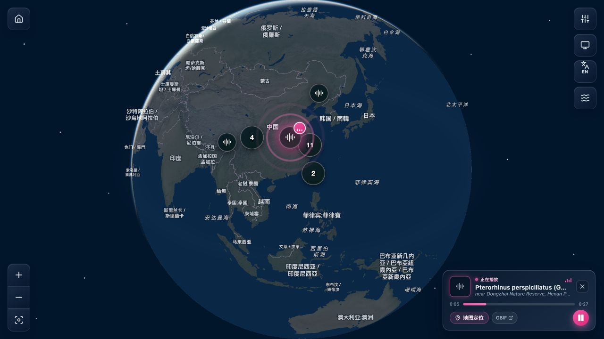

# TanStack Start / PostgreSQL 迁移与验证记录

验证日期：2026-10-06。目标规范：[十万至百万级开发文档](./TANSTACK_START_POSTGRESQL_DEVELOPMENT.md)。

## 当前结果

唯一应用为 `apps/web` 的 TanStack Start。旧 `frontend`、`backend` 目录、Vue/Fastify 入口、重复音频代理和旧启动脚本已删除。原始 6 份数据库迁移完整迁入 `packages/db/migrations`；原始样例 JSON 完整保留为 `data/sample/occurrences.json`。

2026-10-06 真实 ZIP 实测后，当前活动数据集为 `gbif-0038781-20261006`（发布 4），包含 572,391 条 Animalia 观测、566,878 条可定位记录和 753,834 个媒体资产。页面从 PostgreSQL 和已验证 PMTiles 读取数据，预览在 `http://127.0.0.1:4319/`。整体真实数据验收未通过，具体问题和性能指标见[验收报告](./GBIF_REAL_DATA_ACCEPTANCE_20261006.md)。

下表为之前完成迁移的原始样例基线，历史样例仍可回滚读取。

| 原始样例基线 | 数量 |
| --- | ---: |
| 观测记录 | 120 |
| 可定位记录 | 115 |
| 鸟类记录 | 22 |
| 昆虫记录 | 20 |
| 带音频记录 | 20 |
| 声景录音链接 | 22 |

导入及发布过程保留历史快照，因此数据库总记录数可以多于当前活动样例数量。

## 恢复的功能

- 深浅主题：星空、栅格亮度/色彩、海洋、边界、地名与大气，以及玻璃控件和媒体面板。
- 数据集首屏相机和重置参数；样例默认沿用旧版数据边界中心与 1.9 缩放。
- 照片、音频、视频图标、邻近聚合数字；MapLibre 地理投影及球背面隐藏。
- 标记悬停、延迟关闭、聚合列表、观测卡片、筛选数量。
- 照片缩略图列表、全屏原图、方向键与 Escape、源站链接和无图片占位。
- 单条音频：代理、缓存、失败提示、播放进度、暂停、重播、定位及动态光波。
- 声景：单段、2–4 段混音、音量、15/30/60/90 分钟循环倒计时、暂停恢复、停止及失败提示。
- 声景与观测录音互斥，切换或停止取消未完成的请求，释放音频和 Blob URL。
- 完整中英文文案及本地主题/语言偏好。

大数据仍使用 PMTiles 与 PG 游标分页，不将全部记录下载为 DOM 点。照片补取与 DOM 标记上限为 160；密集视野及过滤代表不匹配时使用正确计数的 WebGL 图层。

## CLI 与配置

- `npm run dev` / `dev:web` 均启动 Start；根命令自动读取 `.env` 和 `.env.local`，显式环境变量优先。
- `npm run data:setup -- --sample` 完成样例入库和地图发布。
- `npm run data:setup -- --archive /absolute/path/gbif.zip --version unique-name` 完成 DWCA 流式解压、分批入库、聚合、PG 导出、Docker 瓦片构建、HTTP 与哈希验证、活动发布切换。
- 本地 PMTiles 路由支持 HEAD、GET、Range、206、416 和不可变缓存。
- PG 保存观测记录及媒体元数据；原始媒体通常通过源 URL 或镜像 CDN 加载。

操作步骤见[数据库与 ZIP 导入指南](./LOCAL_DATABASE_AND_GBIF_IMPORT.md)。

## 已执行验证

1. Node.js 22.23.2：Web 生产构建与 TypeScript 检查成功；Worker TypeScript 检查成功。
2. 独立 PostgreSQL/PostGIS 临时容器：**24 个测试文件、82 项测试全部通过**，包含快照、过滤、分页、聚合、发布、回滚、批量媒体、声景成功/失败/部分失败/取消与互斥、照片灯箱键盘操作。
3. 生产 HTTP smoke：持续监听、首页/详情 SSR 页面壳、静态文件、非法 ID 和音频代理参数检查成功。
4. 一份 DWCA 格式测试 ZIP：CLI 从 `meta.xml` 读取，导入 3 条可定位音频观测、5 个媒体资产，构建真实 PMTiles 并发布；新版接口返回相同 3 条记录与 5 个媒体。
5. 最终 Web Docker 镜像构建成功；隔离运行时 health、ready 均 200，能读取 PG，PMTiles Range 返回 206。
6. 浏览器：照片原图正常显示；dark/light 往返、筛选、音频标记与聚合正常；截图中的 Pterorhinus perspicillatus 录音播放成功，27 秒录音进度实际推进，浮动播放器及地图播放光波同步；声景单段播放和倒计时正常。
7. 清理旧版后，无运行代码或脚本依赖旧目录，无 Vue/Fastify 安装项；文档本地链接完整。

上述迁移测试使用的隔离容器和临时服务已清理。真实数据验收的项目开发服务保留在 `http://127.0.0.1:4319/`。

## 真实数据实测与剩余验收

已用用户 ZIP 完成五十万级实测：全部选中观测 ID 对账一致，184,790 条热点记录完整分页通过，瓦片压缩大小检查及发布回滚通过。发现字符串物种键被丢弃、4,068 个 iNaturalist 音频链接被代理拒绝、空坐标变为 0、首屏标记重叠、独立详情布局和 50 并发音频列表超预算。完整证据见[真实数据验收报告](./GBIF_REAL_DATA_ACCEPTANCE_20261006.md)。

当前结果不能代替以下验收：

- 修复未通过项后重新导入、构建与复测；一百万条及其他数据分布验收。
- 真实手机帧率、网络限速、首屏预算及 20 分钟浏览器内存测试。
- 实际生产 CDN、备份恢复和发布回滚演练。
- 目标规范中的完整详情 SSR 数据预取/Query hydration 与 URL 状态同步；当前 SSR 提供页面壳。

源站录音删除或失效时页面会提示播放失败；PG 中保存 URL 不会自动生成已失效的媒体文件。

## 最终效果图

